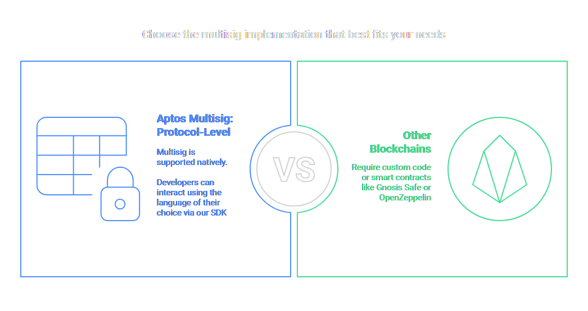

## Account & Transactions

### Accounts Basics
- Accounts are identified by a 32-byte address
- Format: `0x00000000000000000000000000000000` (preferred with leading zeros and 0x)
- Account must exist on-chain before any operations can be performed with it
- Authentication uses key rotation capability
- Every account has:
  - Resources (including coin storage)
  - Increasing sequence number to prevent replay attacks
  - Authentication key
  - Event handles

### Account Creation
```python
# Creating an account
from aptos_sdk.account import Account
new_account = Account.generate()
```

### Address Standards
- Three representations:
  - Full form with 0x: `0x00000000000000000000000000000001` (preferred)
  - Short form: `0x1`
  - No 0x prefix: `00000000000000000000000000000001`

---

## Transaction Handling

### Transaction Basics
- Transactions encoded in Binary Canonical Serialization (BCS)
- Contains: sender address, authentication, operation, gas limit/price
- Each transaction has a unique version number
- Transaction success is indicated by `success` and `vm_status` fields

### Transaction Types
1. **Entry Function** - Call to module entry function
2. **Move Script** - Execute custom Move code

### Transaction Flow
1. Submit transaction
2. Pre-execution validation in Mempool
3. Transmission between Mempool nodes
4. Inclusion in consensus proposal
5. Final pre-execution validation
6. Execution and commit to storage

### Transaction Status and Simulation
- Check status: `/transactions/by_hash/{hash}`
- Simulate transactions: `/transactions/simulate`
- Recommended poll interval: 30-60 seconds

### Example Transaction Flow
```typescript
// Example using TS-SDK
import { Aptos, Ed25519Account, Ed25519PrivateKey } from "@aptos-labs/ts-sdk";

const aptos = new Aptos();
const account = new Ed25519Account({privateKey: new Ed25519PrivateKey("private key")})
const transaction = await aptos.transferCoinTransaction({
    sender: account.accountAddress, 
    recipient: "receiver address", 
    amount: 100000000
})
const pendingTransaction = await aptos.transaction.signAndSubmitTransaction({
    signer: account, 
    transaction
})
const committedTransaction = await aptos.waitForTransaction({
    transactionHash: pendingTransaction.hash
});
```

---

## Asset Standards

### Two Asset Standards
1. **Coin Standard** (original)
   - Similar to ERC-20
   - Uses `0x1::coin::CoinStore<CoinType>` for storage

2. **Fungible Asset Standard** (newer)
   - More featured and advanced
   - Uses `fungible_asset::FungibleStore` objects

### APT Token
- Native token of Aptos
- A "migrated coin" (supports both standards)
- Subunit: octa (1 APT = 100,000,000 octas)

### Checking Balances

#### Coin Balance
```typescript
// Check coin balance
const [balanceStr] = await aptos.view<[string]>({
  payload: {
    function: "0x1::coin::balance",
    typeArguments: [coinType],
    functionArguments: [account]
  }
});
```

#### Fungible Asset Balance
```typescript
// Check fungible asset balance
const [balanceStr] = await aptos.view<[string]>({
  payload: {
    function: "0x1::primary_fungible_store::balance",
    typeArguments: ["0x1::object::ObjectCore"],
    functionArguments: [account, faMetadataAddress]
  }
});
```

### Tracking Balance Changes
- Monitor events and changes in transactions:
  - `0x1::coin::WithdrawEvent`
  - `0x1::coin::DepositEvent`
  - `0x1::fungible_asset::Withdraw`
  - `0x1::fungible_asset::Deposit`
- Gas fees only tracked for APT token 

### Transferring Assets

#### Coin Transfer
```typescript
// Recommended method for transferring coins
0x1::aptos_account::transfer_coins<CoinType>(receiver address, amount)
```

#### Fungible Asset Transfer
```typescript
// Recommended method for transferring fungible assets
0x1::primary_fungible_store::transfer<0x1::object::ObjectCore>(receiver address, amount)
```

---

## Multisig Accounts
If you’re coming from Ethereum/Solidity, note that Aptos handles multisig accounts differently. Aptos implements multisig directly at the protocol level, allowing accounts to require multiple signatures without deploying additional smart contracts.

### Multisig Concept
- Protocol-level multisig (not smart contract-based)
- Configurable K-of-N signature scheme
- Uses `MultiPublicKey` and `MultiSignature`


### Multisig Transaction Flow
1. Create transaction with multisig address as sender
2. Collect K signatures from authorized signers
3. Combine signatures into a multisig authenticator
4. Submit signed transaction


## Exchange Integration

### Infrastructure Recommendations
- Run your own full node
- Use Indexer for efficient data queries

### Balance Tracking
- Query balances using appropriate view functions
- Monitor events for balance changes
- Handle both Coin and Fungible Asset standards

### Deposit/Withdrawal Handling
1. **Monitor Events**:
   - `0x1::coin::DepositEvent` for deposits
   - `0x1::coin::WithdrawEvent` for withdrawals
   - `0x1::fungible_asset::Deposit` for FA deposits
   - `0x1::fungible_asset::Withdraw` for FA withdrawals

2. **Process Transactions**:
   - Monitor transaction versions for ordering
   - Validate transaction success: `success: true`
   - Calculate gas costs for APT transactions

### Popular Stablecoins
- USDt (Tether): `0x357b0b74bc833e95a115ad22604854d6b0fca151cecd94111770e5d6ffc9dc2b`
- USDC: `0xbae207659db88bea0cbead6da0ed00aac12edcdda169e591cd41c94180b46f3b`
- USDY (Ondo): `0xcfea864b32833f157f042618bd845145256b1bf4c0da34a7013b76e42daa53cc::usdy::USDY`


## Transaction Management

### Sequence Number Management
- Each account has a strictly increasing sequence number
- Maximum 100 uncommitted transactions per account
- Check on-chain sequence number to synchronize

### Sequence Number Allocation Strategy
1. Query blockchain for current sequence number
2. Allow up to 100 transactions in flight
3. If 100 transactions in flight, query network for current state
4. Handle expired transactions by resetting sequence numbers

### Transaction Failures
- **Submission failures**: Network issues or validation errors
- **Pre-execution failures**: Detected after timeout expiration
- **Execution failures**: On-chain state issues, committed to blockchain

### Scaling Transaction Throughput
- Use worker accounts sharing a resource account
- Use `SignerCap` for shared account control
- Be aware of read/write conflicts that limit parallelization

### Worker-Leader Pattern
- Resource account as shared identity
- Worker accounts with access to resource account's SignerCap
- Application-specific capabilities for each worker