# Decision Tree Enhancements

Based on Eman's study notes and interview feedback, here are recommendations for enhancing the Aptos Hackathon Decision Tree to better guide developers through their project journey.

## Current Structure Analysis

The current decision tree follows this basic structure:
1. **Entry Point**: "I want to build a dApp"
2. **First Decision**: "Evaluate Aptos" vs. "Use Aptos"
3. **Evaluate Path**: 2-min Pitch → Map of Tools → Showcase Demo
4. **Use Path**: Scope your dApp → (Data & Indexing, Identity & Wallets, Smart Contracts) → Deploy & Test → Hackathon Next Steps

## Key Insights from Eman's Feedback

1. **Make Resources More Visible**: "When we are hacking, we become blind... the thing in front of our eyes and we don't see"
   - Solution: Enhanced visual highlighting of critical resources

2. **Provide Direct Implementation Examples**: Eman mentioned looking for examples to "take the code and tweak it"
   - Solution: Direct links to sample code for each feature

3. **Oracle Integration as a Priority**: Explicitly requested Oracle information
   - Solution: Add Oracle category with more prominence

4. **Interactive Navigation**: "If I have this kind of interactive flowchart where I can click the link"
   - Solution: Make the decision tree interactive with detailed sub-menus

5. **Terminology Clarity**: Confusion around terms like "Vibe Coder"
   - Solution: Use more precise technical terminology

## Enhanced Decision Tree Structure

```mermaid
flowchart TD
    A[👨‍💻 I want to build a dApp] --> B{Decision Point}
    B -->|"Evaluate Aptos 🔍"| C[Evaluate Aptos]
    B -->|"Use Aptos 🚀"| D[Use Aptos]
    
    %% Evaluate Path
    C --> C1[2-min Pitch]
    C1 --> C2[Map of Tools]
    C2 --> C3[Interactive Showcase]
    
    %% Use Path
    D --> E[Scope your dApp]
    
    %% Main Categories
    E --> F1[📊 Data & Indexing]
    E --> F2[🔐 Identity & Wallets]
    E --> F3[📝 Smart Contracts]
    
    %% Data & Indexing Subcategories
    F1 --> G1[Indexer API]
    F1 --> G2[Oracle Integration]
    F1 --> G3[Off-chain Storage]
    F1 --> G4[Event Handling]
    
    %% Identity & Wallets Subcategories
    F2 --> H1[Account Abstraction]
    F2 --> H2[Multisig Accounts]
    F2 --> H3[Sponsored Transactions]
    F2 --> H4[Authentication Methods]
    
    %% Smart Contracts Subcategories
    F3 --> I1[Move Modules]
    F3 --> I2[Resources & Abilities]
    F3 --> I3[Randomness API]
    F3 --> I4[Storage Operations]
    
    %% Deploy & Test
    F1 & F2 & F3 --> J[⚙️ Deploy & Test]
    J --> J1[CLI Deployment]
    J --> J2[Move Testing]
    J --> J3[Frontend Integration]
    
    %% Hackathon Next Steps
    J --> K[🏆 Hackathon Next Steps]
```

## Detailed Component Recommendations

### 1. Enhanced Main Decision Point

Replace the simple "Evaluate/Use" split with a more descriptive decision point:

| Option | Description | Best For |
|--------|-------------|----------|
| **Evaluate Aptos** | "Learn why Aptos might be right for your project" | Developers new to Aptos or comparing chains |
| **Use Aptos** | "Start building with Aptos right away" | Developers ready to build on Aptos |

### 2. Data & Indexing Section Enhancements

Add these clickable subsections with descriptions:

| Subsection | Description | Resources |
|------------|-------------|-----------|
| **Indexer API** | "Query blockchain data efficiently" | Link to Indexer docs, sample queries |
| **Oracle Integration** | "Access real-world data on-chain" | Pyth Network integration code from Eman's notes |
| **Off-chain Storage** | "Store large data off-chain with on-chain verification" | Best practices, sample implementations |
| **Event Handling** | "Track and respond to on-chain events" | Event struct definitions, emission examples |

### 3. Identity & Wallets Section Enhancements

Add these clickable subsections with descriptions:

| Subsection | Description | Resources |
|------------|-------------|-----------|
| **Account Abstraction** | "Flexible auth methods and social logins" | Standard AA vs. Derivable AA comparison |
| **Multisig Accounts** | "Native protocol-level multisig" | Implementation examples, comparison to EVM multisig |
| **Sponsored Transactions** | "Let others pay gas fees for your users" | Backend-as-fee-payer implementation guide |
| **Authentication Methods** | "Different ways to authenticate users" | Social, key-based, and custom auth examples |

### 4. Smart Contracts Section Enhancements

Add these clickable subsections with descriptions:

| Subsection | Description | Resources |
|------------|-------------|-----------|
| **Move Modules** | "Core building blocks for Aptos smart contracts" | Module structure, entry functions |
| **Resources & Abilities** | "Type-safe data with ownership semantics" | Resource definitions, ability explanation |
| **Randomness API** | "Secure on-chain randomness" | Randomness implementation from Eman's notes |
| **Storage Operations** | "Interact with global storage" | move_to, move_from, borrow_global examples |

### 5. Deploy & Test Enhancements

Expand with more specific guidance:

| Subsection | Description | Resources |
|------------|-------------|-----------|
| **CLI Deployment** | "Publish your Move modules" | Step-by-step deployment guide |
| **Move Testing** | "Test your modules before deployment" | Unit testing examples |
| **Frontend Integration** | "Connect your dApp frontend" | TypeScript SDK integration examples |

## Interactive Element Recommendations

1. **Clickable Resource Links**: Each node should expand to show relevant resources

2. **Code Snippet Previews**: Hovering over features should show sample code snippets

3. **Visual Indicators**: Use icons to indicate feature complexity (beginner, intermediate, advanced)

4. **Filter Options**: Allow filtering the tree by developer background (EVM, Solana, Web2)

5. **Progress Tracking**: Let users mark sections as completed while planning their project

By implementing these enhancements, the decision tree will better serve hackathon participants by providing clearer guidance and more direct access to the resources they need for successful implementation.